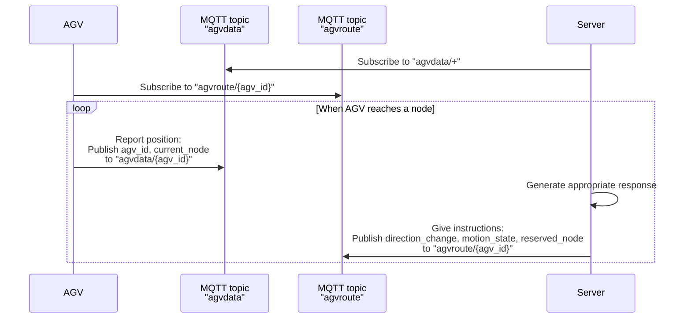

```mermaid
sequenceDiagram
    participant agv as AGV
    participant agvdata as MQTT topic<br/>"agvdata"
    participant agvroute as MQTT topic<br/>"agvroute"
    participant server as Server

    server->>agvdata: Subscribe to "agvdata/+"
    agv->>agvroute: Subscribe to "agvroute/{agv_id}"

    loop When AGV reaches a node
        agv->>agvdata: Report position:<br/>Publish agv_id, current_node<br/>to "agvdata/{agv_id}"
        server->>server: Generate appropriate response
        server->>agvroute: Give instructions:<br/>Publish direction_change, motion_state, reserved_node<br/>to "agvroute/{agv_id}"
    end
```
