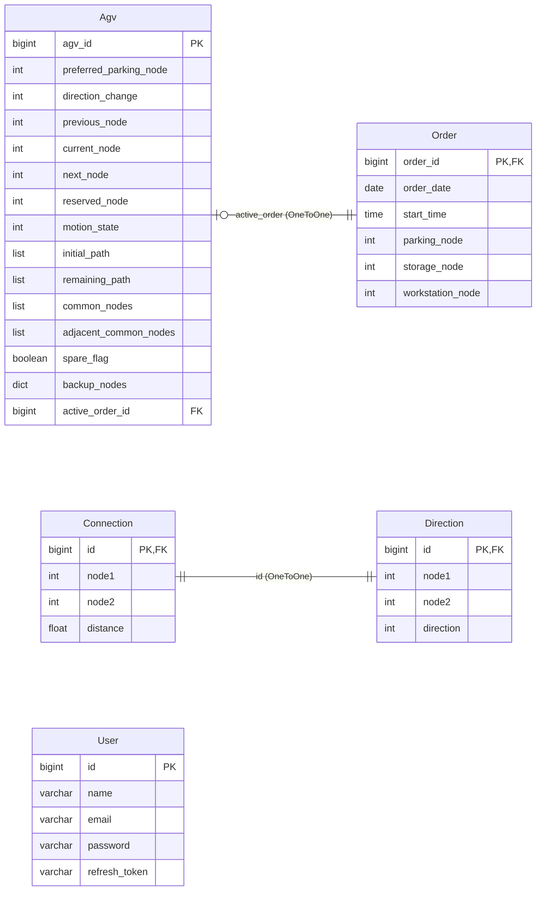

```mermaid
erDiagram
    direction LR

    Agv {
        bigint agv_id PK
        int preferred_parking_node
        int direction_change
        int previous_node
        int current_node
        int next_node
        int reserved_node
        int motion_state
        list initial_path
        list remaining_path
        list common_nodes
        list adjacent_common_nodes
        boolean spare_flag
        dict backup_nodes
        bigint active_order_id FK
    }

    Order {
        bigint order_id PK, FK
        date order_date
        time start_time
        int parking_node
        int storage_node
        int workstation_node
    }


    Connection {
        bigint id PK, FK
        int node1
        int node2
        float distance
    }

    Direction {
        bigint id PK, FK
        int node1
        int node2
        int direction
    }


    User {
        bigint id PK
        varchar name
        varchar email
        varchar password
        varchar refresh_token

    }

    %% Relationships
    Agv |o--|| Order : "active_order (OneToOne)"
    Connection ||--|| Direction : "id (OneToOne)"
```
