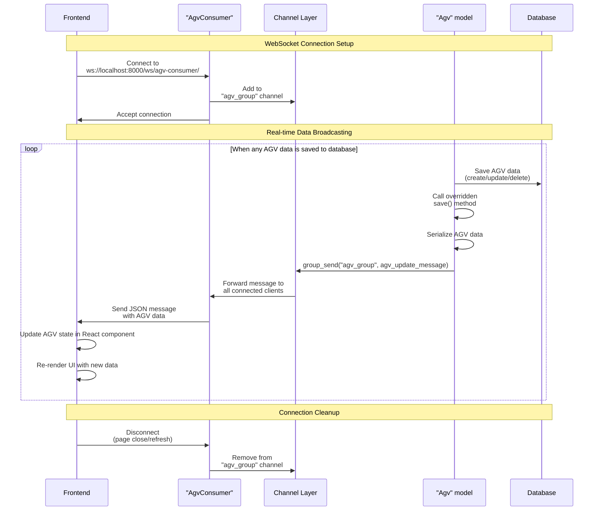

```mermaid
sequenceDiagram
    participant F as Frontend
    participant C as "AgvConsumer"
    participant CL as Channel Layer
    participant M as "Agv" model
    participant DB as Database

    Note over F,DB: WebSocket Connection Setup
    F->>C: Connect to<br/>ws://localhost:8000/ws/agv-consumer/
    C->>CL: Add to<br/>"agv_group" channel
    C->>F: Accept connection

    Note over F,DB: Real-time Data Broadcasting
    loop When any AGV data is saved to database
        M->>DB: Save AGV data<br/>(create/update/delete)
        M->>M: Call overridden<br/>save() method
        M->>M: Serialize AGV data
        M->>CL: group_send("agv_group", agv_update_message)
        CL->>C: Forward message to<br/>all connected clients
        C->>F: Send JSON message<br/>with AGV data
        F->>F: Update AGV state in React component
        F->>F: Re-render UI with new data
    end

    Note over F,DB: Connection Cleanup
    F->>C: Disconnect<br/>(page close/refresh)
    C->>CL: Remove from<br/>"agv_group" channel
```
