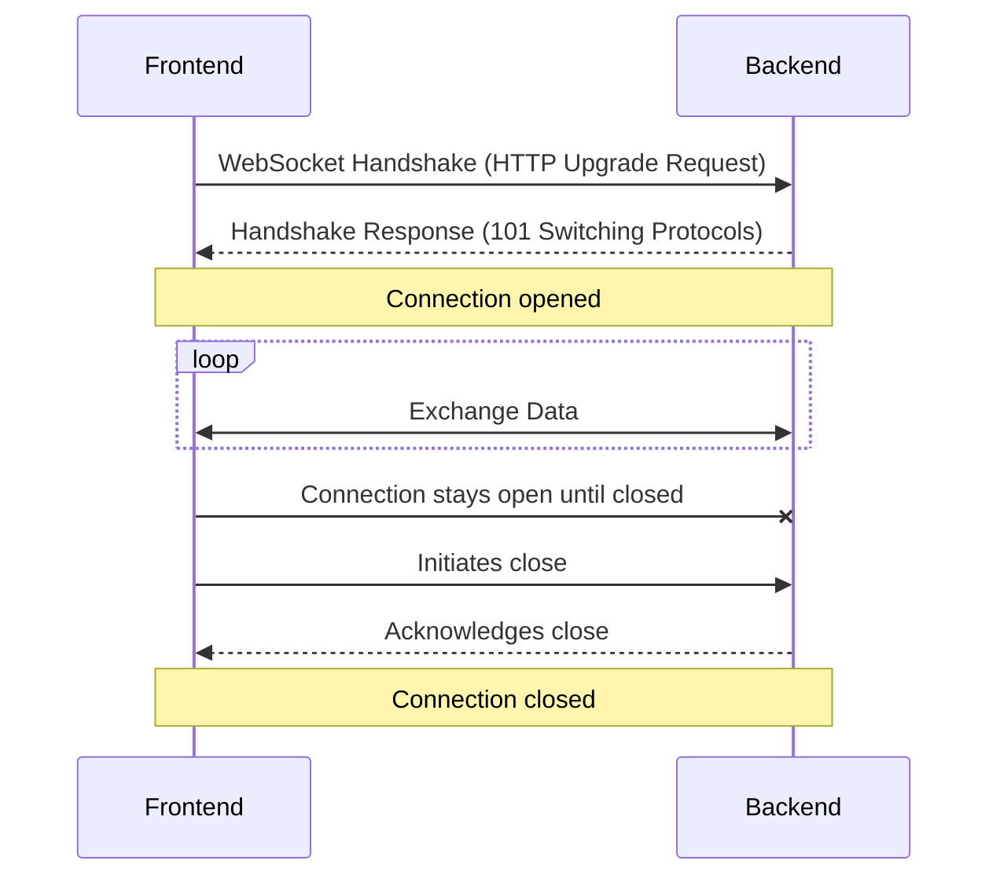

```mermaid
sequenceDiagram
    participant Frontend
    participant Backend

    Frontend->>Backend: WebSocket Handshake (HTTP Upgrade Request)
    Backend-->>Frontend: Handshake Response (101 Switching Protocols)
    Note over Frontend,Backend: Connection opened
    loop
        Frontend<<->>Backend: Exchange Data
    end
    Frontend-xBackend: Connection stays open until closed
    Frontend->>Backend: Initiates close
    Backend-->>Frontend: Acknowledges close
    Note over Frontend,Backend: Connection closed
```
